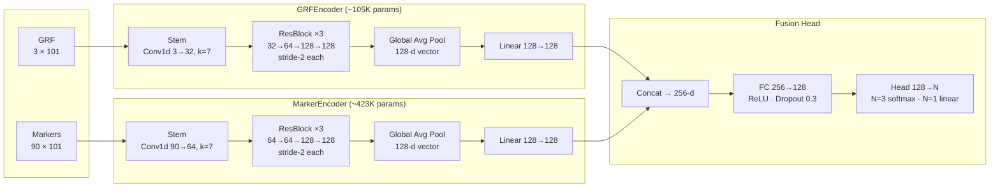
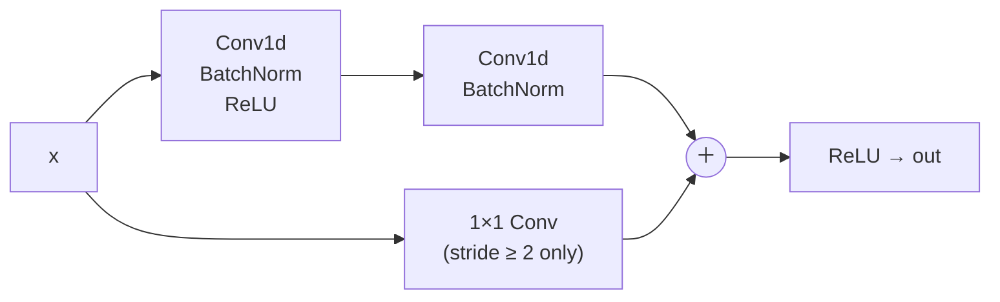

# gait-ml

A deep learning pipeline for classifying human gait speed conditions from raw motion capture and force plate data.

This project started as an attempt to convert existing my MATLAB biomechanics pipelines into Python; that traditional pipeline is preserved (in progress) on the `traditional-pipeline` branch. I decided to pivot toward a deep learning approach instead, to explore models that work directly on raw waveforms rather than the curated features typically used in biomechanics analyses, and to get hands-on experience with PyTorch, 1D CNNs, and multi-modal sensor fusion.

For more about the original research questions and statistical analyses behind this dataset, you can read my incredibly exciting doctoral dissertation [here](https://hdl.handle.net/2142/107990).

**Data:** 70 anonymized subjects (IRB-approved) · 6 speed conditions (3 walking, 3 running) ·
3 trials each · 3D marker trajectories + split-belt treadmill GRF

---

## What this project does

The project has two prediction tasks, both evaluated on raw waveforms with no
hand-crafted features:

1. **3-class condition classification** — predict whether a subject is walking,
   slow running, or fast running from a single gait cycle. The 6 raw conditions
   are grouped as: walking (preferred + fixed-speed + Froude-matched walking),
   slow run (fixed-speed 3.3 m/s + Froude A), fast run (Froude B).
2. **Speed regression** — predict the actual treadmill speed in m/s for a held-out
   subject.

**A note on Froude speeds.** Several conditions use
[Froude number](https://en.wikipedia.org/wiki/Froude_number)-matched speeds
rather than a fixed m/s target. The Froude number normalizes speed by leg
length: `Fr = v² / (g × L)`, where `v` is speed, `g` is gravitational
acceleration, and `L` is leg length. Two subjects walking at the same Froude
number are moving at biomechanically equivalent speeds relative to their body
size — even if their absolute speeds differ by 0.2–0.3 m/s. This is the
standard way to compare gait across individuals of different statures. As a
result, the Froude conditions introduce genuine subject-level speed variation:
there is no single "correct" speed for Froude A or Froude B across the dataset,
which is part of why predicting speed in m/s is a meaningful regression target.

Both tasks use a neural network that learns its own features from the raw
time-series rather than hand-crafted biomechanical variables.

Each gait cycle is represented as two time series:
- **Ground reaction force (GRF):** vertical force under the feet over one stride,
  normalized to body weight. Shape `(3, 101)` — left belt, right belt, total.
- **Marker trajectories:** 3D positions of 30 lower-body markers (pelvis, thighs,
  shanks, feet) over the same stride. Shape `(90, 101)`. Raw filtered positions —
  no hand-crafted joint angle computation. The full trial marker set includes trunk
  and bilateral arm markers (48 total), but these are deliberately excluded — arm
  swing amplitude and frequency scale with speed and would make the problem easier.
  The model must infer gait category from leg and pelvis kinematics alone.

Both signals are time-normalized to 101 points (0–100% of the gait cycle) using
pchip interpolation, matching the standard biomechanics convention.

---

## Deep learning approach

### Why PyTorch instead of scikit-learn?

Scikit-learn is excellent for tabular data — you extract features (columns),
fit a model, predict. But here each sample is not a row of numbers; it is a
time series of 101 timesteps with multiple channels (3 for GRF, 90 for
markers). PyTorch is a framework for building and training neural networks that
operate directly on this kind of structured tensor data. Where scikit-learn
gives you `fit()` and `predict()`, PyTorch gives you the building blocks to
define your own model architecture, specify exactly how data flows through it,
and compute gradients automatically so the model can learn.

The tradeoff: scikit-learn is simpler and has sensible defaults for almost
everything. PyTorch requires you to write the training loop yourself — but that
also means you can do things scikit-learn cannot, like processing raw waveforms,
training on GPU, or fusing two different types of sensor data.

### Why raw data instead of hand-crafted features?

The traditional approach in biomechanics is to extract scalar features first —
"peak knee flexion angle", "vertical loading rate", "contact time" — then feed
those numbers into a classifier like a random forest. This works but has two
problems: (1) you have to decide which features matter before you know the
answer, and (2) a scalar like "peak GRF" throws away the entire shape of the
force curve and keeps only one number.

A neural network operating on the raw 101-point waveform sees the full shape
and can learn to look at whatever part of it is most informative — the slope of
the loading curve, the exact timing of the second peak, the asymmetry between
left and right — without anyone telling it to. The network discovers its own
features during training.

### Architecture: late-fusion two-tower 1D CNN



**Channels** are the parallel signals at each timepoint — 3 for GRF (left belt, right belt, total), 90 for markers (30 markers × XYZ). Every layer processes all channels simultaneously.

**1D convolution** slides a small filter window (7 timepoints wide in the stem) across the waveform. At each position it multiplies element-wise by a learned filter and sums to one number. With multiple filters you get multiple output channels, each detecting a different local pattern. Filters are shared across time, so the same "impact spike detector" fires wherever that shape appears in the cycle.

**ResBlock** adds a skip connection that routes the input directly past two conv layers. The network only has to learn the *correction* on top of the identity, which keeps gradients from vanishing in deeper stacks. This is the core idea from ResNet (He et al., 2016).



The network now only has to learn the *difference* between the input and output
(`F(x)` in `out = F(x) + x`), which is easier. The skip also gives gradients a
direct path backward, keeping training stable in deeper models. This is the key
idea from ResNet (He et al., 2015) and is now standard in CNNs.

**Stride-2** halves the time axis at each stage: 101 → 51 → 26 → 13 timesteps. Later layers see a more compact representation with a wider effective receptive field.

**Global average pooling** averages the 13 remaining timesteps into a single 128-d vector. This gives a fixed-size summary of the whole waveform and makes the model insensitive to exactly where in the cycle a feature peaks — useful since cycle boundaries vary slightly across strides. Both modalities are compressed to 128-d this way, then concatenated into 256-d for the fusion head.

**Late fusion** (two separate encoders rather than one) keeps the GRF and marker streams independent until the concat. GRF is in N/body-weight (~0–3) and markers in mm (~0–1500); mixing them early would confuse the filters. It also makes ablation clean: disable one encoder by passing zeros and you get a single-modality baseline with no architectural changes.

**CNNs vs LSTMs/Transformers.** Gait has strong *local* temporal structure — loading rate, push-off peak shape, swing clearance — which CNNs detect naturally with sliding filters. LSTMs are better suited to long sequences where distant context matters. Transformers would likely overfit with only 70 subjects.

**Output head.** A final linear layer maps 128 values to 3 class logits (classification) or 1 scalar speed (regression). Dropout (30%) is applied before this layer during training.

Three model variants are trained as an ablation study — each answers a
different question about which sensor modality matters:

| Model | Input | Params | Question answered |
|-------|-------|--------|-------------------|
| `GRFOnly{Classifier,Regressor}` | GRF waveforms | ~105K | How much can force alone tell us? |
| `MarkerOnly{Classifier,Regressor}` | Marker trajectories | ~423K | How much can kinematics alone tell us? |
| `TwoTower{Classifier,Regressor}` | Both (late fusion) | ~560K | Does fusion beat either modality alone? |

### Training: how the model learns

Training a neural network is an iterative process:

1. **Forward pass** — run a batch of gait cycles through the model, get
   predictions (class probabilities or speed values).
2. **Loss** — compute how wrong the predictions are. For classification this
   is cross-entropy loss (penalises confident wrong predictions heavily); for
   regression it is Huber loss (like mean squared error but less sensitive to
   outlier cycles).
3. **Backward pass** — PyTorch automatically computes the gradient of the loss
   with respect to every weight in the network (via backpropagation). This tells
   each weight which direction to move to reduce the loss.
4. **Update** — the Adam optimiser uses the gradients to nudge all weights
   slightly in the direction that reduces loss.

Repeat for many batches and many epochs until the model converges.

**Early stopping.** After each epoch the model is evaluated on the held-out
fold (the 7 test subjects). If the validation loss hasn't improved for 15
consecutive epochs, training stops and the best checkpoint is restored. This
prevents the model from memorising the training set — the same role that
pruning or regularisation plays in tree models.

**Cosine learning rate schedule.** The learning rate (how large each weight
update is) starts at 1e-3 and gradually decreases to near-zero following a
cosine curve. Large steps early in training explore the loss landscape quickly;
small steps later let the model settle into a precise minimum without
oscillating.

**Trial-level aggregation for regression.** Each trial has 30–50 cycles, all with the same true speed. Cycles are averaged within each `(subject, condition, trial)` group before the loss is computed, so the gradient is proportional to ~1,260 actual independent trials rather than ~40,000 individual cycles. This is one approach to handling repeated measures in a deep learning context, and the simplest one — chosen deliberately for this first pass. Other options include instance normalization across cycles, adding a subject embedding as a learned input, or weighting the loss inversely by group size. In a traditional statistical analysis of the same data, the natural tool would be a linear mixed model with subjects as a random effect, which explicitly partitions within-subject and between-subject variance rather than aggregating it away.

**A note on PyTorch Lightning.** Lightning is a wrapper that removes training loop boilerplate — you define `training_step()` and `configure_optimizers()` and it handles the epoch loop, device placement, mixed precision, and checkpointing via built-in callbacks. It would work here and would cut `train.py` roughly in half. It's not used for two reasons: (1) this project is partly a learning exercise, and writing the loop explicitly makes the process transparent; (2) the custom `_aggregate_by_group` scatter for trial-level regression averaging would still need to live inside `training_step()` regardless, so Lightning's biggest win — eliminating the loop boilerplate — only applies to the classification side. For a production pipeline with more models and hyperparameter sweeps, switching to Lightning would be worthwhile.

### Cross-validation: why subject-level splitting matters

With repeated-measures data (same subject across multiple conditions and
trials), standard random splits leak information. If a subject appears in both
training and test, the model can learn that subject's personal gait style and
get a falsely optimistic accuracy on the "held-out" set — even though in
deployment it would only ever see new subjects.

The fix is to split by subject, not by cycle. Subjects are randomly divided
into 10 groups of ~7. Each fold trains on 63 subjects (all their cycles) and
tests on the remaining 7 (all their cycles). No subject ever appears in both
sets. The reported accuracy is the mean across all 10 folds — a realistic
estimate of how the model would perform on a person it has never seen before.

This is exactly analogous to group k-fold cross-validation in scikit-learn
(`GroupKFold`), where the group is the subject ID.

---

## Repository structure

```
gait_ml/
  io.py             Load Qualisys TSV files (markers + force plates)
  preprocessing.py  Butterworth filtering, pchip gap-fill, time normalization
  segmentation.py   Heel strike / toe-off detection from GRF threshold
  dataset.py        PyTorch Dataset, CONDITION_LABELS, add_speed_column, kfold_splits helper
  models.py         ConvBlock, ResBlock, GRFEncoder, MarkerEncoder,
                    GRFOnly/MarkerOnly/TwoTower × Classifier + Regressor
  train.py          Training loop, evaluation, CV fold runners (classification + regression)
  kinematics.py     Joint angle computation (traditional pipeline, preserved)
  grf.py            GRF feature extraction (traditional pipeline, preserved)
  features.py       Feature matrix assembly (traditional pipeline, preserved)
  config.py         Lab equipment and acquisition parameters

scripts/
  build_dataset.py  Preprocess all trials → time-normalized cycle cache
  run_cv.py         k-fold (or LOSO) cross-validation for classification or regression

notebooks/
  01_io_preprocessing_smoke_test.ipynb
  02_preprocessing_validation.ipynb       Python vs MATLAB output comparison
  03_results_classification.ipynb         Ablation table, per-condition accuracy, confusion matrix
  03_results_regression.ipynb             Ablation table, predicted vs actual, per-condition RMSE

tests/              pytest suite for kinematics, preprocessing, segmentation, GRF
```

The traditional biomechanics pipeline (kinematics, hand-crafted features,
MATLAB validation) is preserved on the `traditional-pipeline` branch.

---

## Setup and usage

```bash
# Install dependencies
uv sync

# Run tests
uv run pytest

# Step 1: preprocess all trials into a cycle cache (~5–10 min for 70 subjects)
uv run python scripts/build_dataset.py --raw-dir data/raw --out-dir data/processed

# Step 1 (single subject, for debugging)
uv run python scripts/build_dataset.py --raw-dir data/raw --subjects FS6

# Step 2: train models — 3-class classification (walking / slow run / fast run)
uv run python scripts/run_cv.py --task classification --n-classes 3 --model grf_only
uv run python scripts/run_cv.py --task classification --n-classes 3 --model marker_only
uv run python scripts/run_cv.py --task classification --n-classes 3 --model two_tower

# Step 2: train models — regression (requires d_subjectData.csv for actual speeds)
uv run python scripts/run_cv.py --task regression --subject-data data/raw/d_subjectData.csv --model grf_only
uv run python scripts/run_cv.py --task regression --subject-data data/raw/d_subjectData.csv --model marker_only
uv run python scripts/run_cv.py --task regression --subject-data data/raw/d_subjectData.csv --model two_tower

# Low-memory run (25% of cycles) — used for all reported results
uv run python scripts/run_cv.py --task classification --n-classes 3 --subsample-frac 0.25 --model two_tower
uv run python scripts/run_cv.py --task regression --subject-data data/raw/d_subjectData.csv \
    --subsample-frac 0.25 --model two_tower
```

---

## Data format notes

**Qualisys TSV — kinematics:** 160 Hz, 48 markers (54 for static trials).
Coordinates in mm: X = anteroposterior, Y = vertical, Z = mediolateral.

**Qualisys TSV — force plates:** 1120 Hz (7× kinematics rate). Forces in N,
COP in mm. `_f_4` = left treadmill belt, `_f_5` = right treadmill belt.

**Treadmill conventions:**
- Walking: subject uses both belts; each belt records one foot independently.
- Running: subject runs on one belt only; active belt determined by
  `max(Fz) > body_weight_N`. Both feet contact the active belt, so consecutive
  heel strikes alternate between feet — true gait cycles are extracted by taking
  every-other heel strike pair.

**GRF normalization:** body weight computed from mean vertical GRF during a
quiet standing trial (`QuietStance3_f_3.tsv`), matching the MATLAB pipeline.

---

## Results

Both tasks evaluated with 10-fold cross-validation (subject-level splits, ~7 subjects per fold).
Results below were generated on a 25% stratified subsample of cycles per
subject/condition (memory constraint); full-data results may differ slightly.

### 3-class classification (walking / slow run / fast run)

Conditions are grouped as:
- **Walking** — walk_preferred, walk_predetermined, walk_froude
- **Slow run** — run_predetermined (3.3 m/s fixed), run_froude_a
- **Fast run** — run_froude_b (Froude B, highest intensity)

**A note on difficulty.** The walk vs. run distinction is biomechanically
massive (flight phase, no double support) and should be near-perfect for any
reasonable model. The more interesting question is whether slow run and fast run
are actually discriminable.

Because Froude B speeds are set by leg length, a tall subject's Froude B speed
may be similar to a short subject's Froude A or predetermined speed. The class
boundary in condition-label space does not map cleanly to a boundary in speed
space — so the model may have no reliable signal to separate the two running
classes for some subjects. If the confusion matrix shows heavy slow_run ↔
fast_run misclassification, that is a meaningful finding: it would indicate that
Froude B is not biomechanically distinguishable from the slower running
conditions using lower-body kinematics and GRF alone, without knowing the
subject's leg length.

The counter-argument is that subjects at the same Froude number are in
biomechanically equivalent states relative to their body size, so waveform
shapes may cluster by Froude number even when absolute speeds overlap — but
whether the model recovers this is an open empirical question.

The regression task sidesteps this entirely by predicting actual speed in m/s,
which is a well-defined target regardless of condition label.

Results pending — run the classification commands above and open
`notebooks/03_results_classification.ipynb`.

### Speed regression (predict m/s from a single gait cycle)

| Model | RMSE (m/s) | MAE (m/s) | R² |
|---|---|---|---|
| GRF only | 0.120 ± 0.064 | 0.093 ± 0.049 | 0.983 ± 0.018 |
| Markers only | 0.075 ± 0.051 | 0.058 ± 0.040 | 0.993 ± 0.012 |
| Two-Tower (fused) | **0.075 ± 0.037** | 0.058 ± 0.029 | **0.993 ± 0.007** |

Key findings:
- All three models achieve R² > 0.98 — speed is highly predictable from gait
  waveforms, which is expected given the large dynamic range (walk ~1.0–1.6 m/s
  vs. run ~2.5–4.0 m/s).
- **Markers outperform GRF alone** (RMSE 0.075 vs 0.120 m/s). Kinematics carry
  more consistent speed information across subjects; GRF is confounded by body
  weight variation.
- **Fusion reduces variance rather than mean error.** The Two-Tower model's fold
  std drops from 0.051 to 0.037 relative to Markers-only — it generalizes more
  reliably across subjects even when the mean RMSE is similar.

### Could simple linear regression get the same results?

Probably not at the same accuracy, for two reasons:

1. **Input dimensionality.** The raw input is 303 (GRF) or 9,090 (markers)
   features per cycle. Flattening and running ridge regression would be severely
   underdetermined with 70 subjects and subject-level CV. You'd need to first
   compress to hand-crafted scalars (peak GRF, contact time, stride frequency,
   etc.), which a ridge model on 5–10 such features might get to R² ~0.85–0.92.

2. **Within-condition discrimination.** The easy part — walk vs. run — is almost
   linearly separable in a few scalar features. The hard part is distinguishing
   walk_preferred from walk_froude from walk_predetermined, where speeds differ by
   only ~0.1–0.2 m/s and scalar features overlap heavily. The CNN picks up on
   subtle waveform shape differences (peak timing, loading-rate curvature) that
   are hard to hand-engineer.

See `notebooks/03_results_regression.ipynb` and
`notebooks/03_results_classification.ipynb` for full plots and ablation tables.

---

## Acknowledgements

This project was built with significant assistance from
[Claude](https://claude.ai) (Anthropic), used as a coding assistant throughout.
Claude contributed to architecture design, implementation of the PyTorch
training pipeline, cross-validation infrastructure, Captum attribution
analysis, and documentation. All scientific decisions, experimental design, and
biomechanics domain knowledge are the author's own.

---

## References

He, K., Zhang, X., Ren, S., & Sun, J. (2016). Deep residual learning for image recognition. *Proceedings of the IEEE Conference on Computer Vision and Pattern Recognition (CVPR)*, 770–778. https://arxiv.org/abs/1512.03385

Kingma, D. P., & Ba, J. (2015). Adam: A method for stochastic optimization. *Proceedings of the 3rd International Conference on Learning Representations (ICLR)*. https://arxiv.org/abs/1412.6980

Kokhlikyan, N., Miglani, V., Martin, M., Wang, E., Alsallakh, B., Reynolds, J., Melnikov, A., Kliushkina, N., Araya, C., Yan, S., & Reblitz-Richardson, O. (2020). Captum: A unified and generic model interpretability library for PyTorch. *arXiv preprint arXiv:2009.07896*. https://arxiv.org/abs/2009.07896

Sundararajan, M., Taly, A., & Yan, Q. (2017). Axiomatic attribution for deep networks. *Proceedings of the 34th International Conference on Machine Learning (ICML)*, *70*, 3319–3328. https://arxiv.org/abs/1703.01365

Wikipedia. (n.d.). Froude number. In *Wikipedia*. https://en.wikipedia.org/wiki/Froude_number
